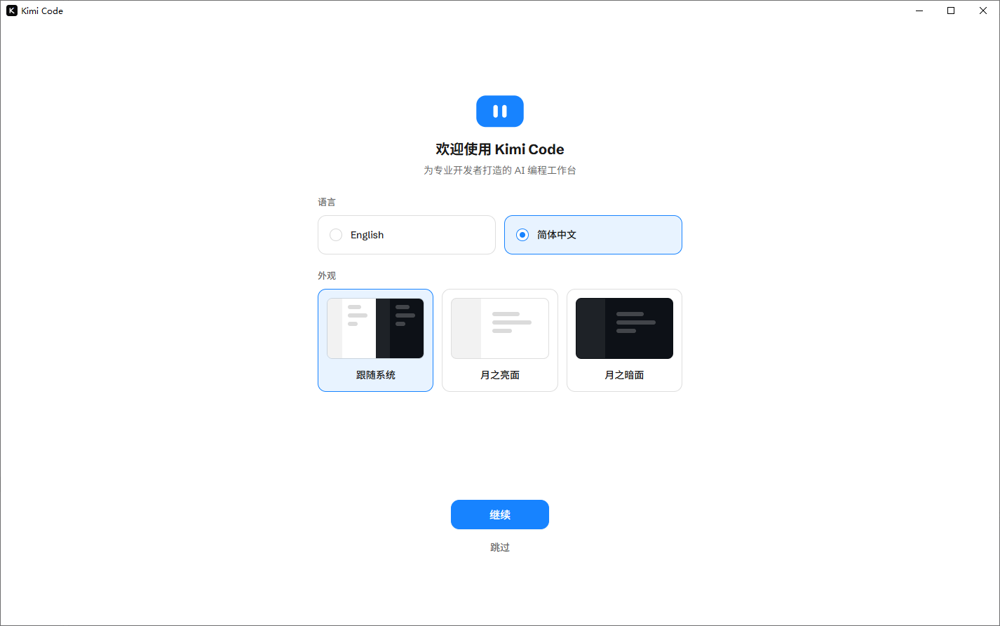
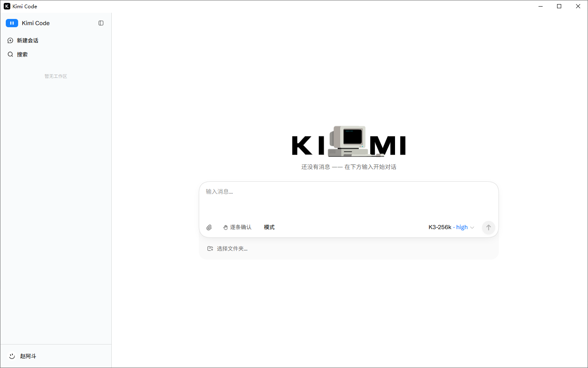

# Kimi Code

Kimi Code Web 桌面客户端，支持一键安装/更新 Kimi Code CLI、每小时自动检测新版本。

## 界面截图

**首次启动：欢迎页（语言 / 外观选择）**

**主界面：AI 编程工作台**

## 下载

前往 [Releases](https://github.com/adozhao/kimi-code-client/releases/latest) 页面下载最新版本：

| 文件 | 说明 |
| --- | --- |
| `Kimi.Code.Setup.x.y.z.exe` | 安装版（推荐）：可自定义安装目录，自动创建桌面/开始菜单快捷方式 |
| `Kimi.Code-x.y.z-portable.exe` | 便携版：免安装，单文件直接运行 |

## 功能

- 自动启动本地 `kimi web` 服务，窗口内直接打开使用
- 默认端口被占用时自动切换到随机端口
- 一键安装 / 更新 Kimi Code CLI（`npm install -g @moonshot-ai/kimi-code`）
- 每小时自动检测 npm 上的最新版本，有更新时提示
- 状态面板：CLI 当前版本、最新版本、服务运行状态、服务地址
- 支持重启服务、在浏览器中打开服务页面

## 系统要求

- Windows 10 / 11（x64）
- 已安装 [Node.js](https://nodejs.org/)（含 npm），用于安装和运行 Kimi Code CLI

## 快速上手

1. 下载并运行安装程序（或直接运行便携版）。
2. 首次启动若未检测到 Kimi Code CLI，点击界面上的「安装 CLI」按钮，等待安装完成。
3. 安装完成后服务会自动启动，即可在窗口内开始使用。
4. 之后 CLI 有新版本时，点击「更新 CLI」即可一键升级。

## ☕ 打赏支持

如果这个项目帮到了你，欢迎请作者喝杯咖啡 ☕

| 支付宝 | 微信支付 |
| :---: | :---: |
|  |  |

## License

MIT